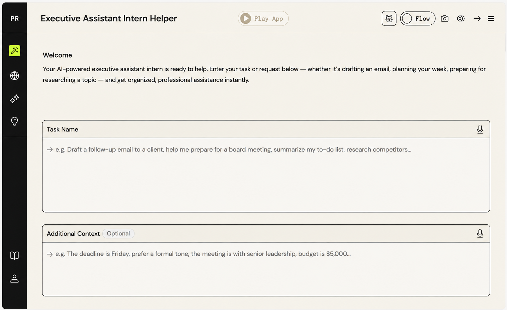
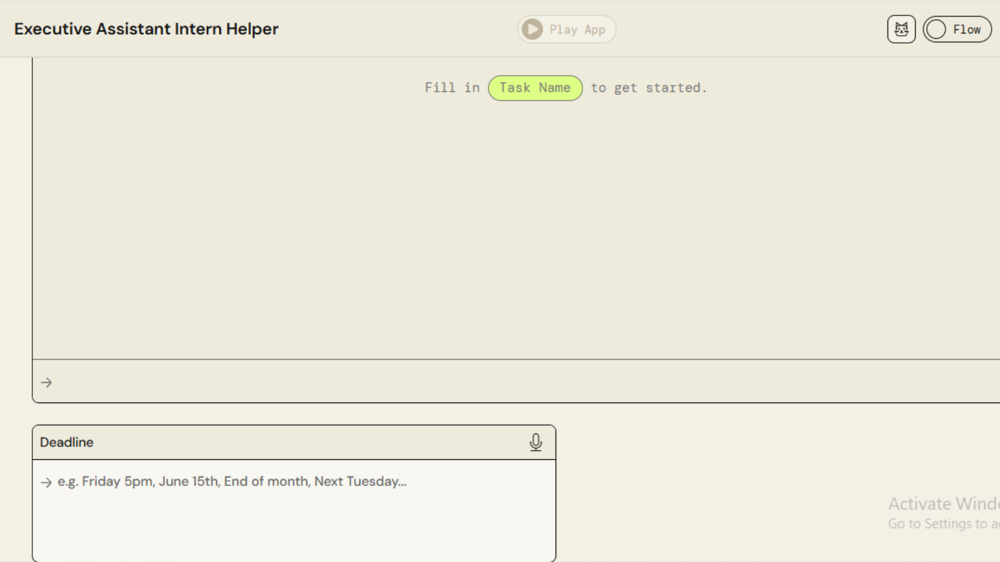
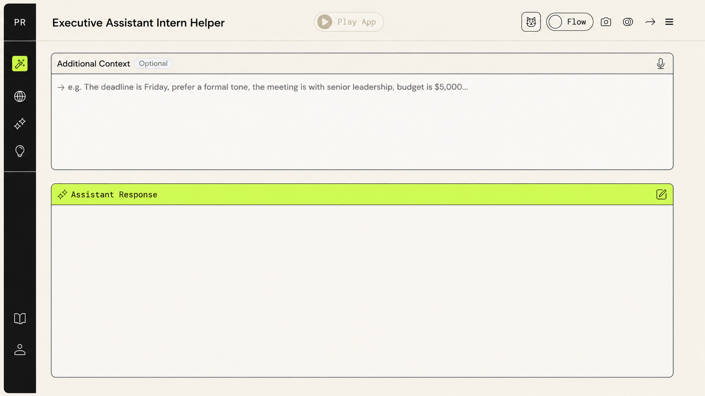
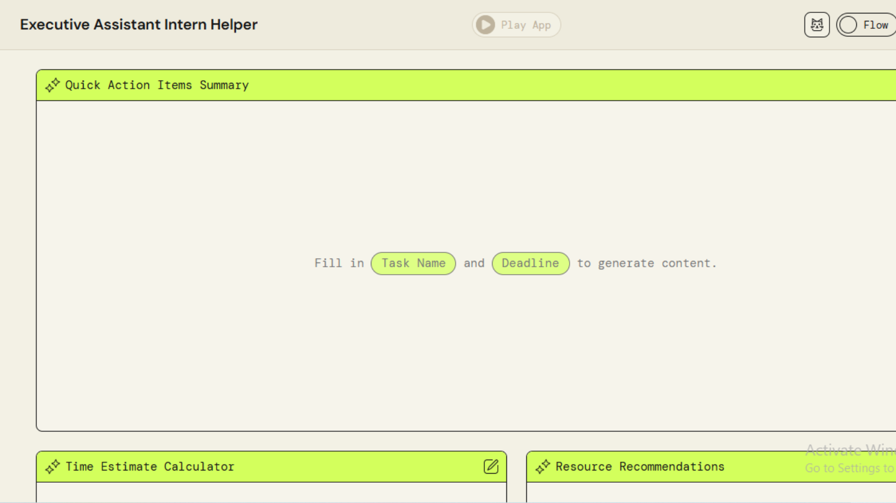
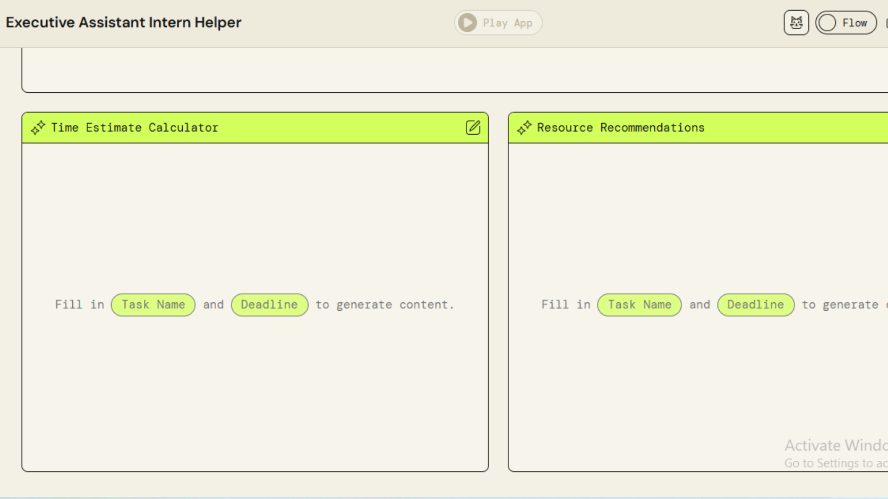

# Executive Assistant Intern Helper (ExecAssist AI)

An AI-driven productivity tool built on Amazon Bedrock (via AWS PartyRock) that gives executives and their assistants organized, professional support across task management, planning, research, and meeting preparation.

🔗 **Live app:** https://partyrock.aws/u/miranagorom/KszYTTinf/Executive-Assistant-Intern-Helper

## Screenshots

**Welcome & task input**

**Task & deadline input**

**Assistant response**

**Quick action items summary**

**Time estimate & resource recommendations**

## How it works

The app takes a single natural-language task or request and fans it out into multiple AI-generated outputs, each reasoning over the same shared inputs from a different angle.

**Inputs**
- **Task Name** — free-text description of the task or request (e.g. "draft a follow-up email to a client," "help me prepare for a board meeting")
- **Additional Context** *(optional)* — deadline, tone preference, stakeholders, budget, or other constraints
- **Deadline** — free-text (e.g. "Friday 5pm," "End of month")

**AI-generated outputs**
- **Assistant Response** — the core response to the task/request, generated from Task Name + Additional Context
- **Follow-up Questions** — clarifying questions the AI generates based on the task, to surface missing information before proceeding
- **Quick Action Items Summary** — a condensed summary of action items, generated once Task Name and Deadline are filled in
- **Time Estimate Calculator** — an AI-generated time estimate for completing the task
- **Resource Recommendations** — suggested resources or references relevant to completing the task

## Why this is more than a single-prompt tool

Each widget reasons over the same shared task context but is scoped to a distinct sub-problem — drafting a response, surfacing what's missing, estimating effort, and recommending resources — rather than cramming everything into one generic prompt. This mirrors how a real agentic system decomposes a broad goal into coordinated sub-tasks, even though this specific implementation runs on PartyRock's widget model rather than custom orchestration code.

## Why I built this

As an Agentic AI Product Leader, I wanted hands-on proof — not just strategy — that I can design and ship a working AI system end to end: scoping the problem, defining the interconnected components, and shipping something usable. This project reflects how I think about agentic workflows: breaking a broad task (executive support) into coordinated, purpose-built components rather than one generic prompt.

## Tech

Built on **AWS PartyRock**, powered by foundation models via **Amazon Bedrock**.

## Roadmap

- [ ] Migrate core logic to a standalone tool-calling agent (Python + Claude API) integrating live Google Calendar, Gmail, and Slack
- [ ] Add persistent memory across sessions
- [ ] Expand meeting-prep widget with automatic agenda generation from calendar context

---
*Built by [Miracle Maduabuchi](https://www.linkedin.com/in/miracle-maduabuchi) — Agentic AI Product Leader, The Light Strategy Forge*
